### Домашнее задание к занятию "3.5. Файловые системы"

####1. Узнайте о sparse (разряженных) файлах.
Файлы, в которых вместо хранения всей последовательности нулевых байтов в файле хранится специальная информация о наличии такой последовательности. За счет этого экономится дисковое пространство, однако затрачиваются дополнительные ресурсы на обработку такого файла.

####2. Могут ли файлы, являющиеся жесткой ссылкой на один объект, иметь разные права доступа и владельца? Почему?
Нет, когда создается жесткая ссылка, создается дополнительный указатель на существующий файл, но не копия файла. Фактически жесткая ссылка это еще одно имя для файла. Жесткие ссылки и сам исходный файл имеют один inode, уникальный идентификатор, поэтому жесткая ссылка имеет те же права доступа, владельца и время последней модификации, что и целевой файл. 

####4. Используя fdisk, разбейте первый диск на 2 раздела: 2 Гб, оставшееся пространство.
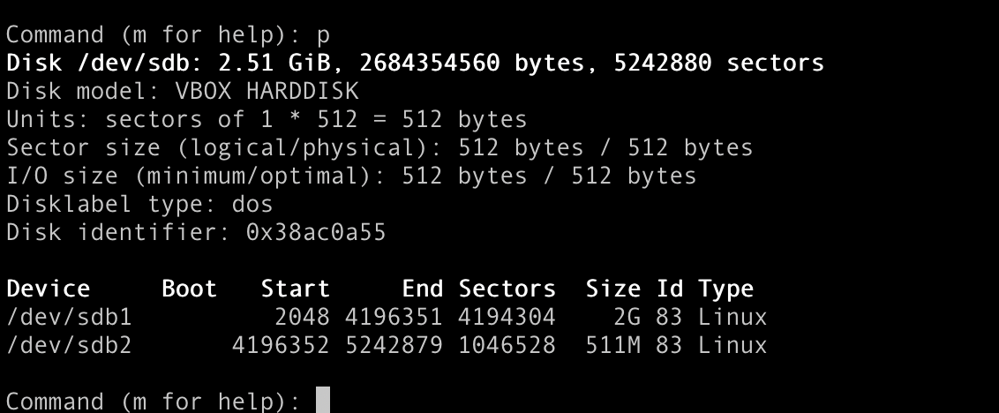

####5. Используя sfdisk, перенесите данную таблицу разделов на второй диск.
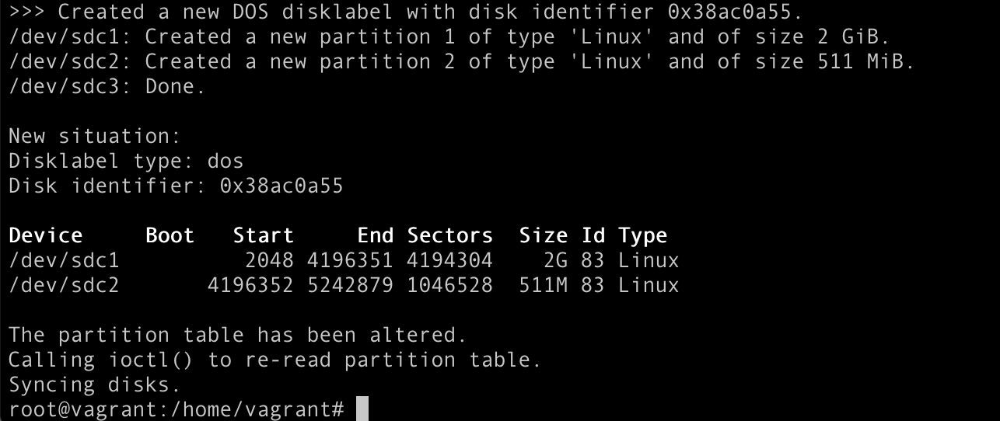

####6. Соберите mdadm RAID1 на паре разделов 2 Гб.
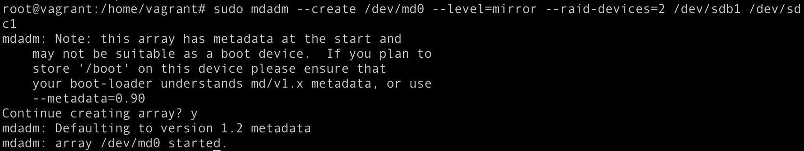

####7. Соберите mdadm RAID0 на второй паре маленьких разделов.
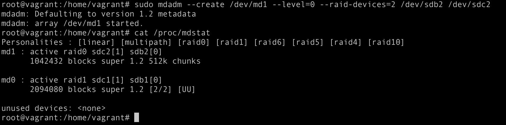

####8. Создайте 2 независимых PV на получившихся md-устройствах.
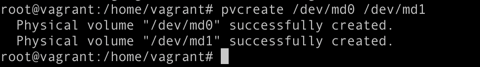

####9. Создайте общую volume-group на этих двух PV.
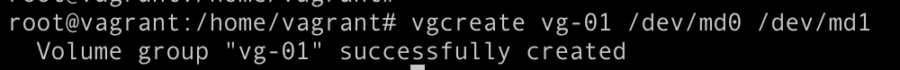

####10. Создайте LV размером 100 Мб, указав его расположение на PV с RAID0.
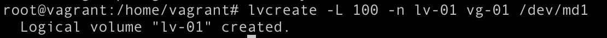

####11. Создайте mkfs.ext4 ФС на получившемся LV.
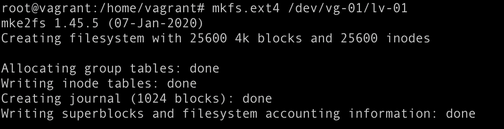

####12. Смонтируйте этот раздел в любую директорию, например, /tmp/new.
`mount /dev/vg-01/lv-01 /tmp/new`

####13. Поместите туда тестовый файл, например wget https://mirror.yandex.ru/ubuntu/ls-lR.gz -O /tmp/new/test.gz.
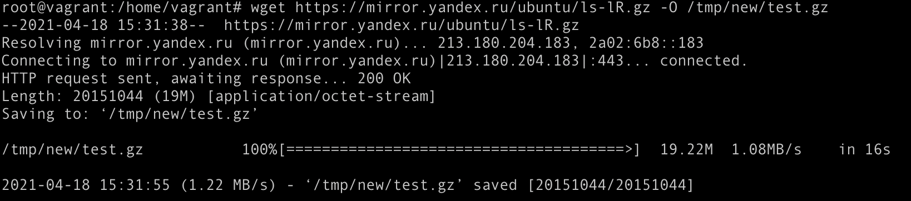

####14. Прикрепите вывод lsblk.
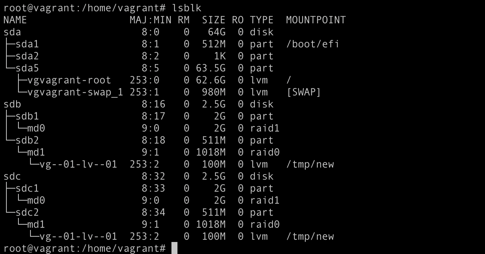

####15. Протестируйте целостность файла:
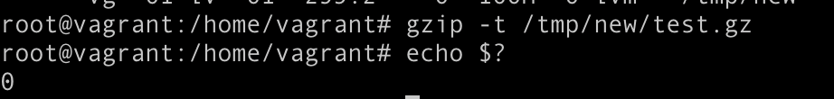

####16. Протестируйте целостность файла:

####17. Сделайте --fail на устройство в вашем RAID1 md.
`mdadm --fail /dev/md0 /dev/sdb1`

####18. Подтвердите выводом dmesg, что RAID1 работает в деградированном состоянии.
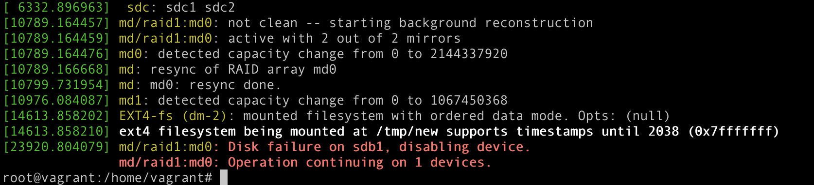

####19. Протестируйте целостность файла, несмотря на "сбойный" диск он должен продолжать быть доступен:
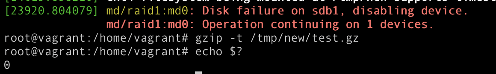

