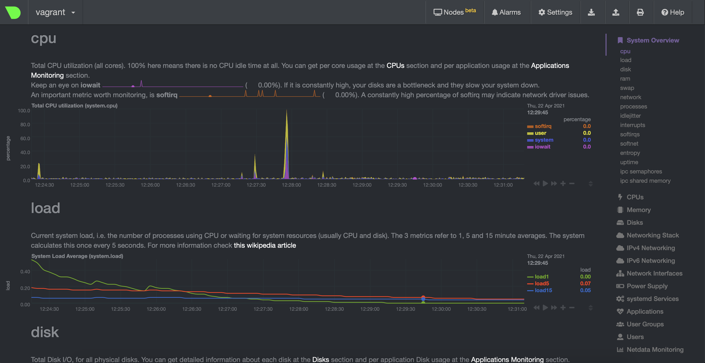
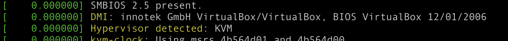
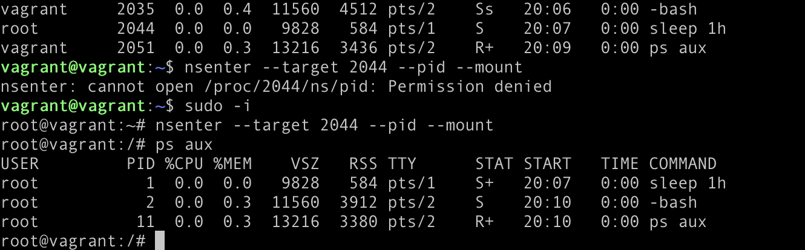
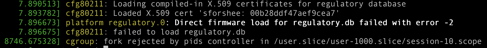

### Домашнее задание к занятию "3.4. Операционные системы, лекция 2"

####1. node_exporter
Unit-файл:
```bash
[Unit]
Description=Node Exporter
After=network.target
 
[Service]
User=node_exporter
Group=node_exporter
Type=simple
ExecStart=/usr/local/bin/node_exporter
 
[Install]
WantedBy=multi-user.target
```

Автозагрузка:

`sudo systemctl enable node_exporter`

Возможность добавления опций к запускаемому процессу через внешний файл:

Можно заранее флаги указать в отдельном файле:

```bash
ARG1=-o
ARG2=--verbose
```

В .service написать:
```bash
EnvironmentFile=/etc/.argconf
ExecStart=/usr/bin/prog $ARG1 $ARG2
```

####2. Ознакомьтесь с опциями node_exporter и выводом /metrics по-умолчанию. Приведите несколько опций, которые вы бы выбрали для базового мониторинга хоста по CPU, памяти, диску и сети.
cpu - exposes CPU statistics

cpufreq - exposes CPU frequency statistics

meminfo - exposes memory statistics

netclass - exposes network interface info from /sys/class/net/

netdev - exposes network interface statistics such as bytes transferred

netstat - exposes network statistics from /proc/net/netstat 


####3. Ознакомьтесь с метриками, которые по умолчанию собираются Netdata и с комментариями, которые даны к этим метрикам.

Сбоку указаны категории, по которым собираются метрики, они разбиты по группам.

####4. Можно ли по выводу dmesg понять, осознает ли ОС, что загружена не на настоящем оборудовании, а на системе виртуализации?
Да:



####5. Как настроен sysctl fs.nr_open на системе по-умолчанию? Узнайте, что означает этот параметр. Какой другой существующий лимит не позволит достичь такого числа (ulimit --help)?
`vagrant@vagrant:~$ sysctl fs.nr_open`

fs.nr_open = 1048576

Это максимальное количество файловых дескрипторов, которые может выделить процесс. Soft limit - 1024, hard limit можно увеличить только под root.


####6. Запустите любой долгоживущий процесс (не ls, который отработает мгновенно, а, например, sleep 1h) в отдельном неймспейсе процессов; покажите, что ваш процесс работает под PID 1 через nsenter. Для простоты работайте в данном задании под root (sudo -i). Под обычным пользователем требуются дополнительные опции (--map-root-user) и т.д.
После примененного `unshare -f --pid --mount-proc sleep 1h`



####7. Найдите информацию о том, что такое :(){ :|:& };:. Запустите эту команду в своей виртуальной машине Vagrant с Ubuntu 20.04 (это важно, поведение в других ОС не проверялось). Некоторое время все будет "плохо", после чего (минуты) – ОС должна стабилизироваться. Вызов dmesg расскажет, какой механизм помог автоматической стабилизации. Как настроен этот механизм по-умолчанию, и как изменить число процессов, которое можно создать в сессии?
:(){ :|:& };:
:() определяем функцию с именем :

{ :|: &} означает запустить функцию : и снова отправить ее вывод в функцию : и запустить ее в фоновом режиме.

; является разделителем команд.

: запускает функцию в первый раз.

По сути, создаем функцию :(), которая дважды вызывает себя при каждом вызове и не имеет возможности завершить себя. Он будет увеличиваться вдвое, пока не закончатся системные ресурсы.

cgroup: fork rejected by pids controller in /user.slice/user-1000.slice/session-10.scope



Чтобы изменить лимит числа процессов, надо изменить файл `/etc/security/limits.conf`, например добавить:
`usr hard nproc 12345`
