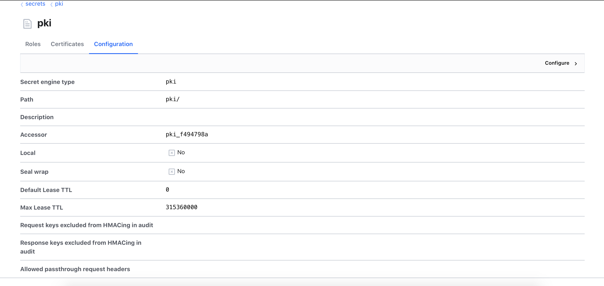
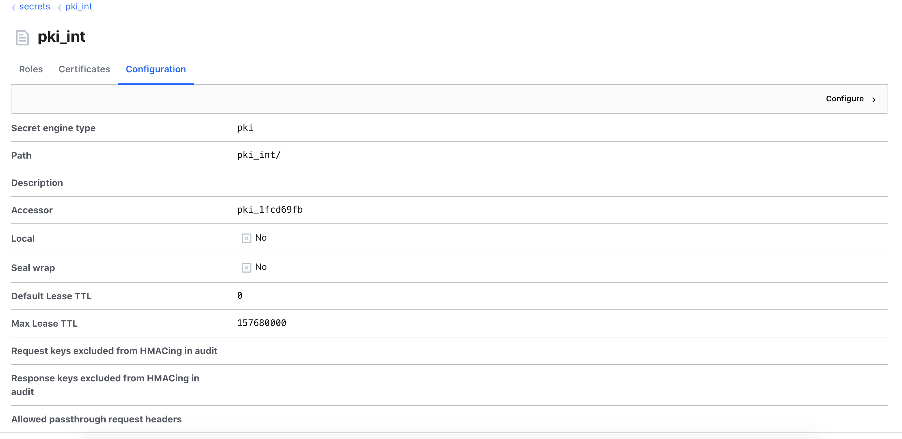
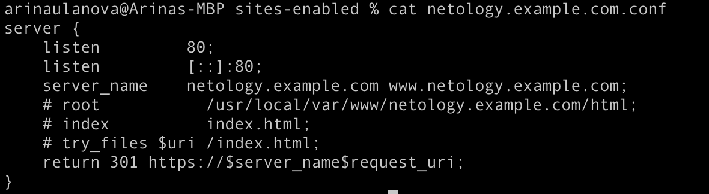
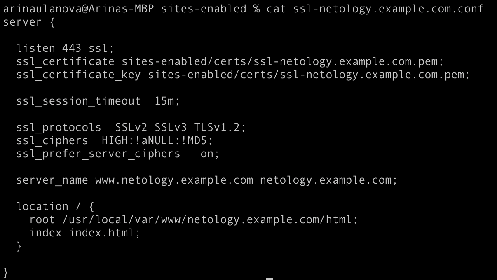
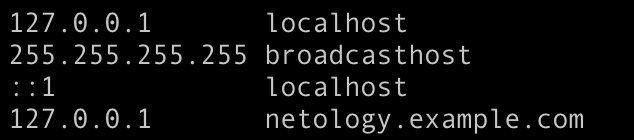
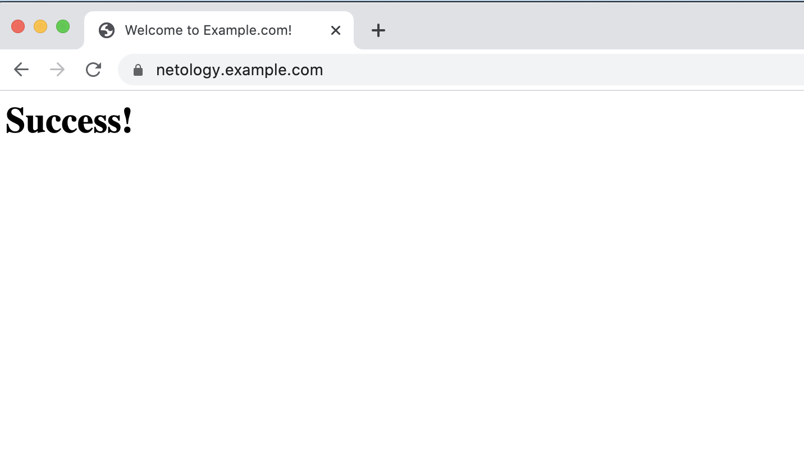

####3. 

####4. 

####5&6.
Конфиг для localhost:

Конфиг для ssl:

/etc/hosts:

Результат:

####7.
Автоматизированная среда управления сертификатами (ACME) - это стандартный протокол для автоматизации проверки домена, установки и управления сертификатами X.509. 

Let’s Encrypt — центр сертификации, предоставляющий бесплатные криптографические сертификаты X.509 для шифрования передаваемых через интернет данных HTTPS и других протоколах, используемых серверами в Интернете. Процесс выдачи сертификатов автоматизирован.
Сервис предоставляется публичной организацией Internet Security Research Group (ISRG).
