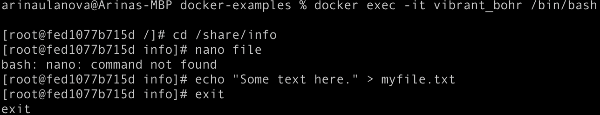
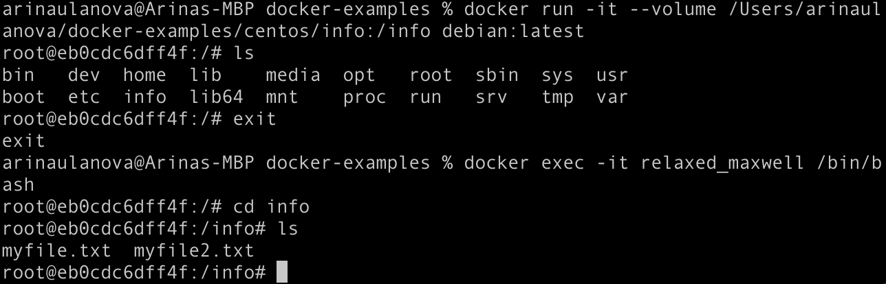
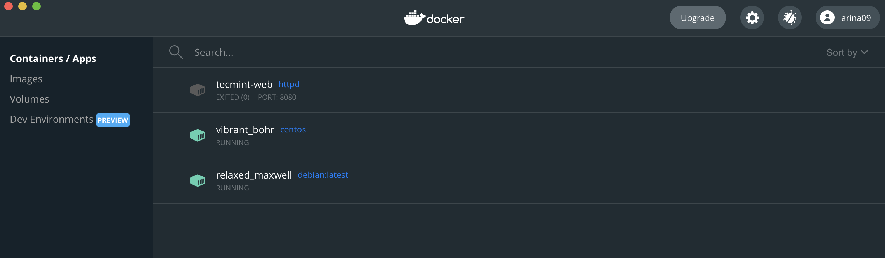

# Домашнее задание к занятию "5.3. Контейнеризация на примере Docker"

## Задача 1
Docker:
Высоконагруженное монолитное java веб-приложение
Go-микросервис для генерации отчетов
Jenkins-сервер

Виртуальная машина:
Мобильное приложение c версиями для Android и iOS

Физическая машина:
База данных postgresql используемая, как кэш
Mongodb, как основное хранилище данных для java-приложения
Очередь для Logstash на базе Redis
Шина данных на базе Apache Kafka

Docker/Физ машина:
Elastic stack для реализации логирования продуктивного веб-приложения - три ноды elasticsearch, два logstash и две ноды kibana
Мониторинг-стек на базе prometheus и grafana

Виртуальные машины подходят для поддержки приложений, которым требуется полная функциональность операционной системы, когда надо развернуть несколько приложений на сервере или когда вам нужно управлять множеством операционных систем. Контейнеры - лучший выбор, когда главная задача - минимизировать количество серверов, используемых для нескольких приложений.
Поэтому вероятно в случае с мобильным приложением на базе Android/iOS больше подойдет виртуальная машина, потому что необходимо поддерживать разные ОС.
В случае с различными хранилищами памяти, подойдут больше физические сервера, так как необходимо персистентно хранить данные, не допуская их потери. В остальном можно использовать Docker.
В случае с Elastic stack и мониторинг-стеком на базе prometheus и grafana возможно используются часто оба решения, но чтобы избежать потери данных c Docker, следует смонтировать volume, который будет сохраняться после удаления контейнера.

## Задача 2
https://hub.docker.com/repository/docker/arina09/apache-example

## Задача 3

