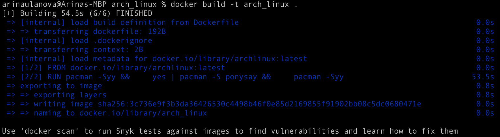
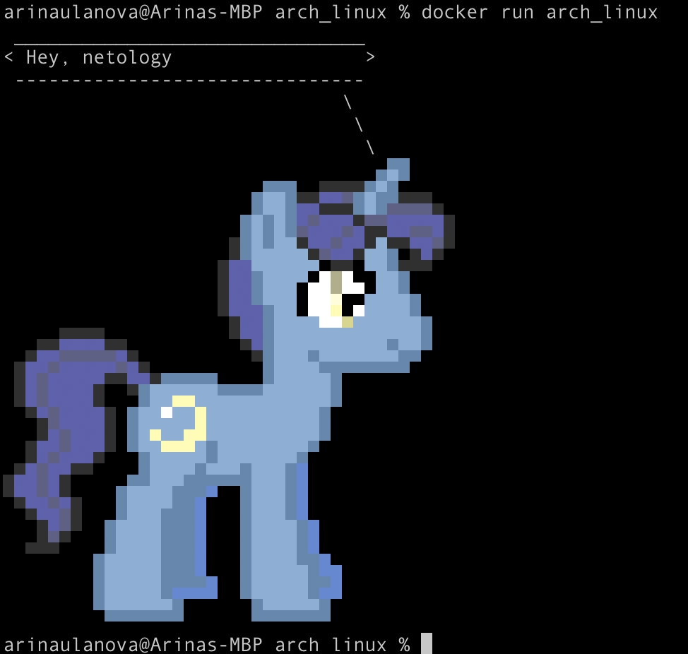
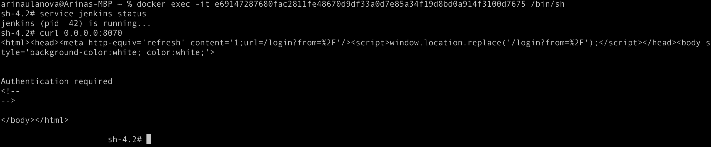
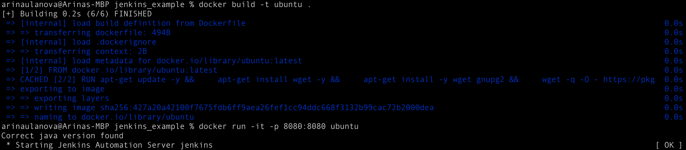
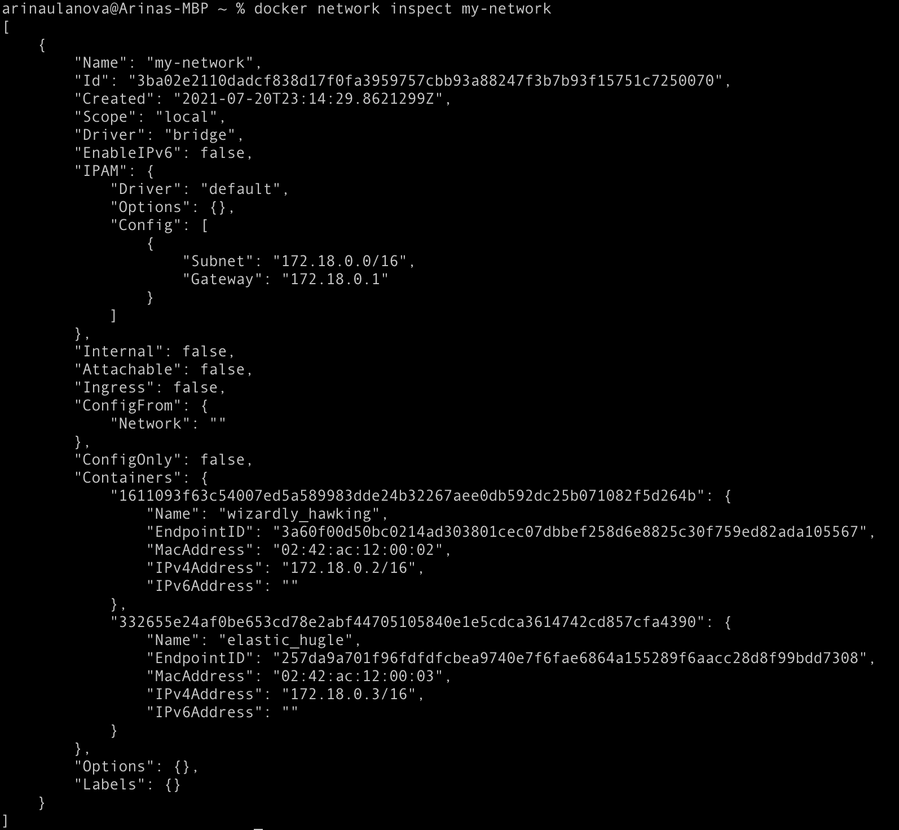
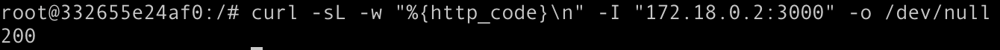
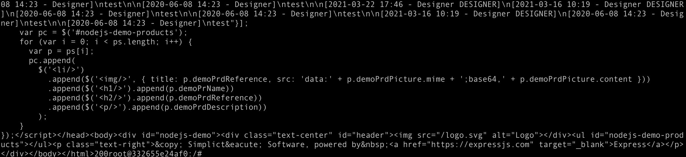

# Домашнее задание к занятию "5.4. Практические навыки работы с Docker"

## Задача 1

```text
FROM archlinux:latest

RUN pacman -Syy && \
    yes | pacman -S ponysay && \
    pacman -Syy

ENTRYPOINT ["/usr/bin/ponysay"]
CMD ["Hey, netology"]

```




https://hub.docker.com/repository/docker/arina09/archlinux-example


## Задача 2

Команды:
* docker build -t ubuntu .
* docker run -it -p 8080:8080 ubuntu
* docker build -t amazon .
* docker run -it -p 8070:8070 amazon
* docker commit magical_mahavira arina09/amazoncorretto-example:ver1
* docker push arina09/amazoncorretto-example:ver1


Amazoncorretto:
```text
FROM amazoncorretto:latest

USER root

RUN yum update -y && \
    yum install initscripts -y && \
    yum install wget -y && \
    wget -O /etc/yum.repos.d/jenkins.repo \
        https://pkg.jenkins.io/redhat-stable/jenkins.repo && \
    rpm --import https://pkg.jenkins.io/redhat-stable/jenkins.io.key && \
    yum install jenkins -y && \
    sed -i 's/JENKINS_PORT="8080"/JENKINS_PORT="8070"/g' /etc/sysconfig/jenkins

ENTRYPOINT service jenkins start && bash
```

Ubuntu:
```text
FROM ubuntu:latest

USER root

RUN apt-get update -y && \
    apt-get install wget -y && \
    apt-get install -y wget gnupg2 && \
    wget -q -O - https://pkg.jenkins.io/debian/jenkins.io.key | apt-key add - && \
    sh -c 'echo deb http://pkg.jenkins.io/debian-stable binary/ > /etc/apt/sources.list.d/jenkins.list' && \
    apt update && \
    apt install default-jdk -y && \
    apt install jenkins -y


ENTRYPOINT service jenkins start && bash
```

Amazon:


Ubuntu:


* https://hub.docker.com/repository/docker/arina09/amazoncorretto-example
* https://hub.docker.com/repository/docker/arina09/ubuntu-example

## Задача 3

Команды:
* docker build -t node .
* docker run -it -p 3000:3000 --network=my-network node
* docker network inspect my-network
* docker run -it --network=my-network ubuntu:latest
* curl -sL -w "%{http_code}\n" -I "172.18.0.2:3000" -o /dev/null

Dockerfile npm:
```text
FROM node:latest

#Install some dependencies

WORKDIR /usr/app
COPY ./ /usr/app
RUN npm install

# Set up a default command
CMD [ "npm","start" ]
```



Без огромного вывода:


Часть огромного вывода:
