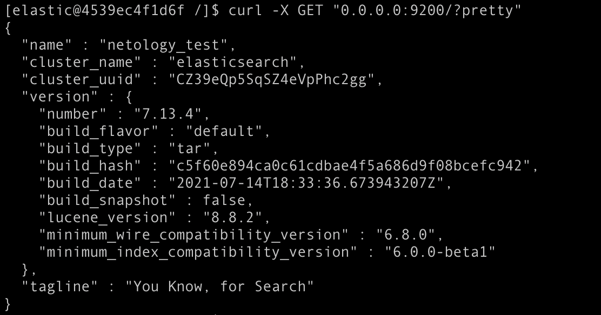
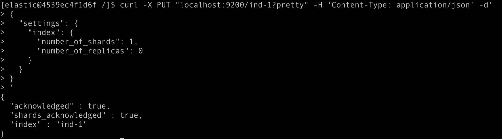
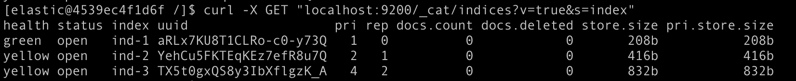
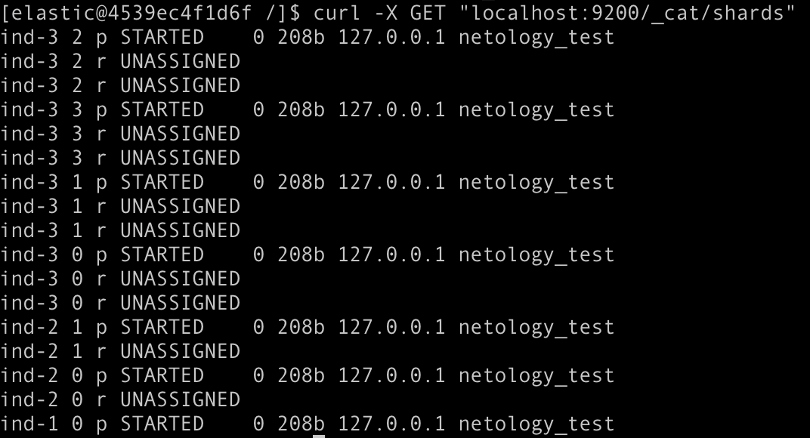
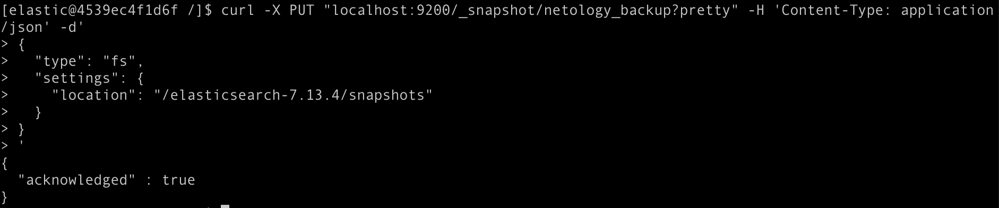
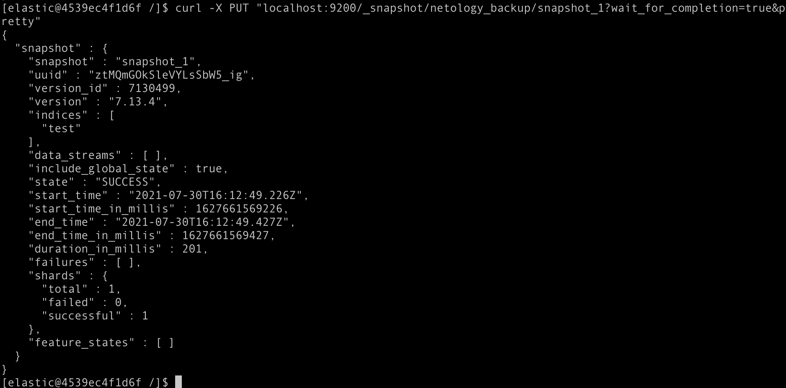
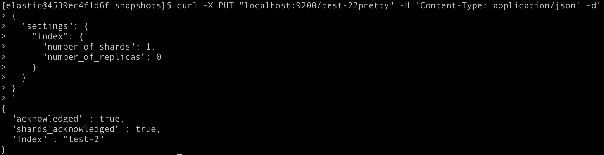
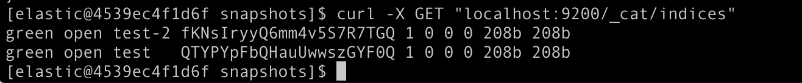

# Домашнее задание к занятию "6.5. Elasticsearch"

https://github.com/netology-code/virt-homeworks/tree/master/06-db-05-elasticsearch

## Задача 1

```text
FROM centos:7

USER root

RUN yum update -y && \
    yum install -y wget && \
    wget https://artifacts.elastic.co/downloads/elasticsearch/elasticsearch-7.13.4-linux-x86_64.tar.gz  && \
    wget https://artifacts.elastic.co/downloads/elasticsearch/elasticsearch-7.13.4-linux-x86_64.tar.gz.sha512 && \
    yum install -y perl-Digest-SHA && \
    shasum -a 512 -c elasticsearch-7.13.4-linux-x86_64.tar.gz.sha512 && \
    tar -xzf elasticsearch-7.13.4-linux-x86_64.tar.gz && \
    yum install sudo -y && \
    sudo adduser elastic && \
    sudo chown -R elastic /var/lib/

RUN echo "elastic:1234" | chpasswd

USER elastic

ENTRYPOINT elasticsearch-7.13.4/bin/elasticsearch -d && bash

```

docker run -it -p 8080:8080 elastic -e user=elastic -e password=1234

cd /elasticsearch-7.13.4/config/elasticsearch.yml

curl -X GET "0.0.0.0:9200/?pretty"




## Задача 2

```text
curl -X PUT "localhost:9200/ind-1?pretty" -H 'Content-Type: application/json' -d'
{
  "settings": {
    "index": {
      "number_of_shards": 1,  
      "number_of_replicas": 0 
    }
  }
}
'
```


```
curl -X PUT "localhost:9200/ind-2?pretty" -H 'Content-Type: application/json' -d'
{
  "settings": {
    "index": {
      "number_of_shards": 2,  
      "number_of_replicas": 1 
    }
  }
}
'
```


```
curl -X PUT "localhost:9200/ind-3?pretty" -H 'Content-Type: application/json' -d'
{
  "settings": {
    "index": {
      "number_of_shards": 4,  
      "number_of_replicas": 2 
    }
  }
}
'
```



curl -X GET "localhost:9200/_cat/indices"




Здесь индексы 2 и 3 в состоянии yellow, потому что primary шарды в состоянии started, но secondary шарды еще в состоянии unassigned, только у 1-ого индекса только один шард primary и он started, поэтому состояние green:



curl -X DELETE "localhost:9200/ind-1"

## Задача 3

```
curl -X PUT "localhost:9200/_snapshot/netology_backup?pretty" -H 'Content-Type: application/json' -d'
{
  "type": "fs",
  "settings": {
    "location": "/elasticsearch-7.13.4/snapshots"
  }
}
'
```

cd /elasticsearch-7.13.4/snapshots

```
curl -X PUT "localhost:9200/test?pretty" -H 'Content-Type: application/json' -d'
{
  "settings": {
    "index": {
      "number_of_shards": 1,  
      "number_of_replicas": 0 
    }
  }
}
'
```

```
curl -X PUT "localhost:9200/_snapshot/netology_backup/snapshot_1?wait_for_completion=true&pretty"
```

```
curl -X DELETE "localhost:9200/test"
```

```
curl -X PUT "localhost:9200/test-2?pretty" -H 'Content-Type: application/json' -d'
{
  "settings": {
    "index": {
      "number_of_shards": 1,  
      "number_of_replicas": 0 
    }
  }
}
'
```

```
curl -X POST "localhost:9200/_snapshot/test-2/snapshot_1/_restore?pretty"

curl -X POST "localhost:9200/_snapshot/test-2/snapshot_1/_restore?pretty"
```










