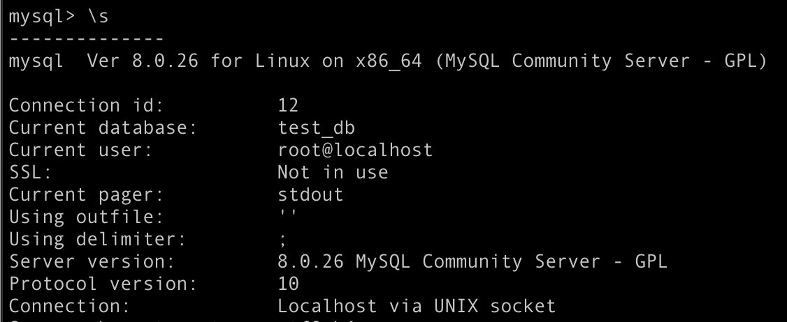
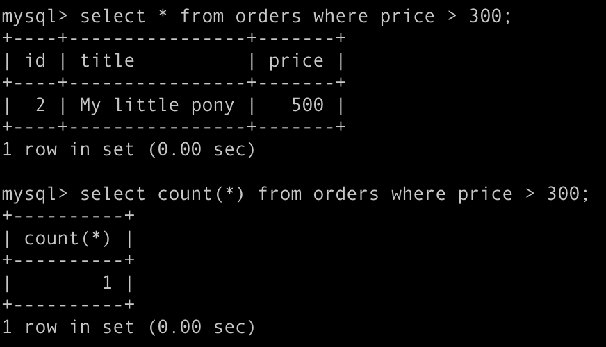
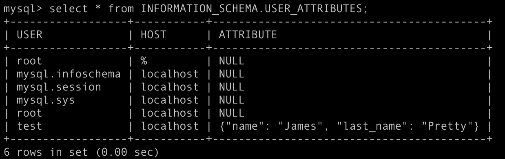
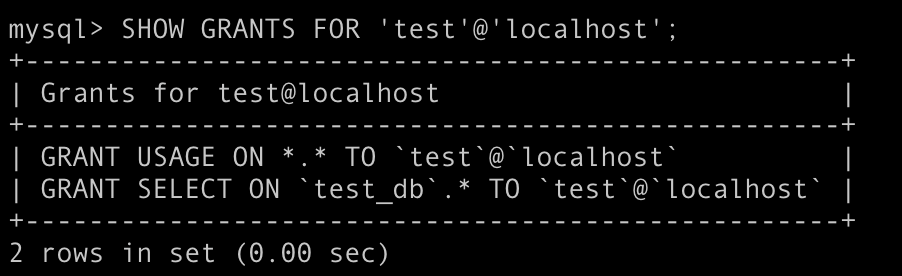
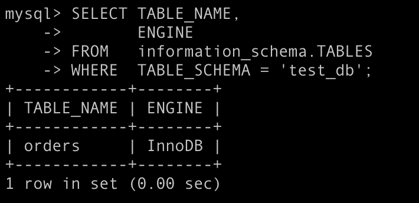
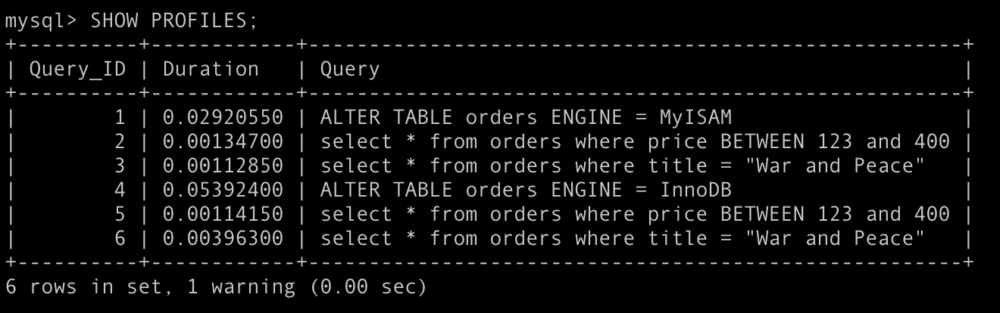
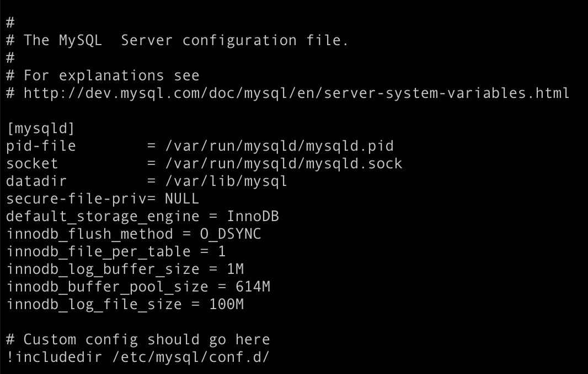

# Домашнее задание к занятию "6.3. MySQL"

https://github.com/netology-code/virt-homeworks/tree/master/06-db-03-mysql

## Задача 1

docker run --name container-mysql -e MYSQL_ROOT_PASSWORD=1234 -d -v ~/docker-examples/hw7/:/tmp/backup/ mysql

mysql -u root -p

create database test_db;

mysql -u root -p test_db < /tmp/backup/backup.sql

## Задача 2

CREATE USER 'test'@'localhost' IDENTIFIED WITH mysql_native_password BY 'test-pass';

GRANT SELECT ON test_db.* TO 'test'@'localhost';

ALTER USER 'test'@'localhost'
PASSWORD EXPIRE INTERVAL 180 DAY
FAILED_LOGIN_ATTEMPTS 3
ATTRIBUTE '{"name": "James", "last_name": "Pretty"}';

## Задача 3

Дефолтный движок:

ALTER TABLE orders ENGINE = MyISAM;

MyISAM быстрее для чтения:

## Задача 4

* Движок InnoDB: 
default_storage_engine = InnoDB
* Скорость IO важнее сохранности данных: 
innodb_flush_method = O_DSYNC (O_DSYNC работает быстрее, но O_DIRECT обеспечивает большую надежность процесса записи)
* Нужна компрессия таблиц для экономии места на диске:
innodb_file_per_table = 1
* Размер буффера с незакомиченными транзакциями 1 Мб:
innodb_log_buffer_size = 1M
* Буффер кеширования 30% от ОЗУ (ОЗУ 2 GB Docker-а):
innodb_buffer_pool_size = 614M
* Размер файла логов операций 100 Мб:
innodb_log_file_size = 100M

