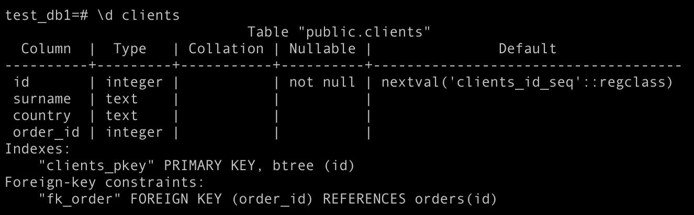
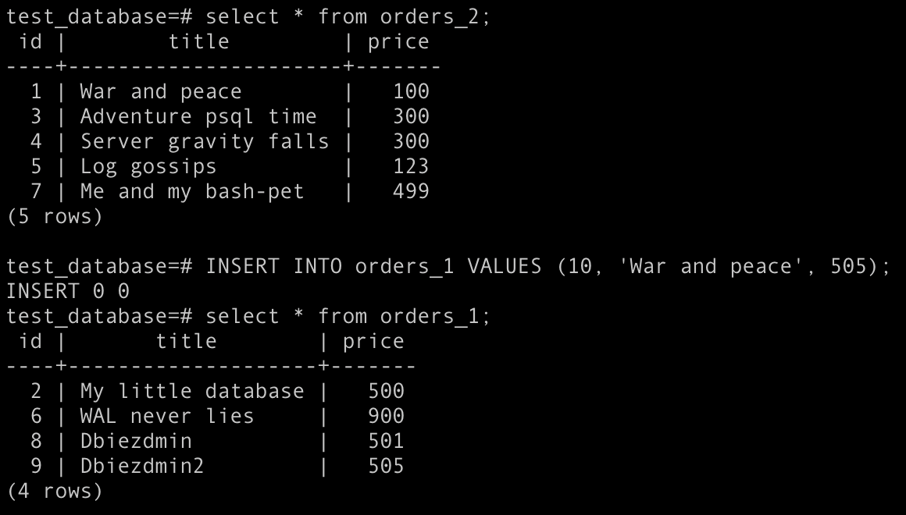

# Домашнее задание к занятию "6.4. PostgreSQL"

https://github.com/netology-code/virt-homeworks/tree/master/06-db-04-postgresql

## Задача 1
docker run --name pgdocker -e POSTGRES_PASSWORD=1234 -e POSTGRES_USER=test-admin-user -e POSTGRES_DB=testdb -d -p 5432:5432 -v hw5_database-backup:/tmp/backup/ postgres

* Вывод списка БД: \l


* Подключение к БД: \c test_db1


* Вывод списка таблиц: \dt


* Вывод описания содержимого таблиц: \d clients


* Выход из psql
\q

## Задача 2
* docker run --name pgdocker -e POSTGRES_PASSWORD=1234 -v ~/docker-examples/hw8/:/tmp/backup/ postgres

* psql --username=postgres

* CREATE DATABASE test_database;

* \c test_database

* В бд:
\i /tmp/backup/test_dump.sql

* select attname, avg_width from pg_stats where tablename = 'orders' ORDER BY avg_width DESC;


## Задача 3

```text
BEGIN TRANSACTION;

CREATE TABLE orders_1 (
    CONSTRAINT pk_1 PRIMARY KEY (id),
    CONSTRAINT ck_1 CHECK ( price > 499 )
) INHERITS (orders);

INSERT INTO orders_1 (id, title, price)
SELECT id, title, price
from orders
where price > 499;

CREATE TABLE orders_2 (
    CONSTRAINT pk_2 PRIMARY KEY (id),
    CONSTRAINT ck_2 CHECK ( price <= 499 )
) INHERITS (orders);

INSERT INTO orders_2 (id, title, price)
SELECT id, title, price
from orders
where price <= 499;

COMMIT;
```

Можно было изначально при создании таблицы добавить PARTITION BY RANGE (price).
Тогда можно было бы одной командой партицировать: CREATE TABLE orders_1 PARTITION OF orders FOR VALUES FROM (499) TO (MAXVALUE);

## Задача 4

pg_dump -U postgres -d test_database > /tmp/backup/backup.sql

Если имеется в виду, что надо убедиться в уникальности title по всем таблицам, то наверное с помощью триггера только:

```text
CREATE OR REPLACE FUNCTION inserted_at()
RETURNS TRIGGER AS $$
BEGIN
  IF (SELECT COUNT(*) FROM orders WHERE title = NEW.title) <> 0 OR 
  (SELECT COUNT(*) FROM orders_1 WHERE title = NEW.title) <> 0 OR 
  (SELECT COUNT(*) FROM orders_2 WHERE title = NEW.title) <> 0 THEN
  RETURN NULL;
  ELSE
    RETURN NEW;
  END IF;
END;
$$ language 'plpgsql';

DO $$
DECLARE
    t text;
BEGIN
    FOR t IN
        SELECT  table_name FROM information_schema.columns
             WHERE column_name = 'title'    
    LOOP
        EXECUTE format('CREATE TRIGGER update_title_%I
                        BEFORE INSERT OR UPDATE ON %I
                        FOR EACH ROW EXECUTE PROCEDURE inserted_at()',
                        t,t);
    END loop;
    END;
$$ language 'plpgsql';
```


