# Домашнее задание к занятию "6.2. SQL"

https://github.com/netology-code/virt-homeworks/tree/master/06-db-02-sql

## Задача 1

* docker-compose run database bash

* psql --host=database --username=test-admin-user --dbname=test_db

* CREATE TABLE orders (id SERIAL PRIMARY KEY, name TEXT, price INTEGER);
* CREATE TABLE clients (id SERIAL PRIMARY KEY, surname TEXT, country TEXT, order_id INTEGER, CONSTRAINT fk_order FOREIGN KEY(order_id) REFERENCES orders(id));

* CREATE ROLE admin WITH SUPERUSER;

* GRANT ALL PRIVILEGES ON ALL TABLES IN SCHEMA public TO "test-admin-user";

* CREATE ROLE "test-simple-user";

* GRANT SELECT, INSERT, UPDATE, DELETE ON ALL TABLES IN SCHEMA public TO "test-simple-user";

* SELECT grantee, privilege_type FROM information_schema.role_table_grants WHERE table_name='orders';
  SELECT grantee, privilege_type FROM information_schema.role_table_grants WHERE table_name='clients';

Docker-compose:
```text
version: '3'
services:
  database:
    image: "postgres" # use latest official postgres version
    env_file:
      - database.env # configure postgres
    volumes:
      - database-data:/var/lib/postgresql/data
      - database-backup:/tmp/backup
volumes:
  database-data: # named volumes can be managed easier using docker-compose
  database-backup:
```

database.env:
```text
POSTGRES_USER=test-admin-user
POSTGRES_PASSWORD=1234
POSTGRES_DB=test_db
```


## Задача 2

Итоговый список БД после выполнения пунктов:
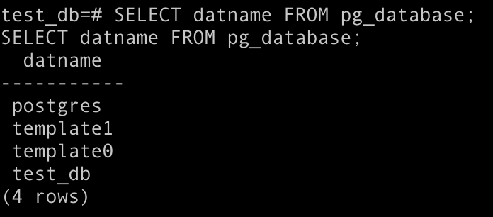

Описание таблиц (describe):
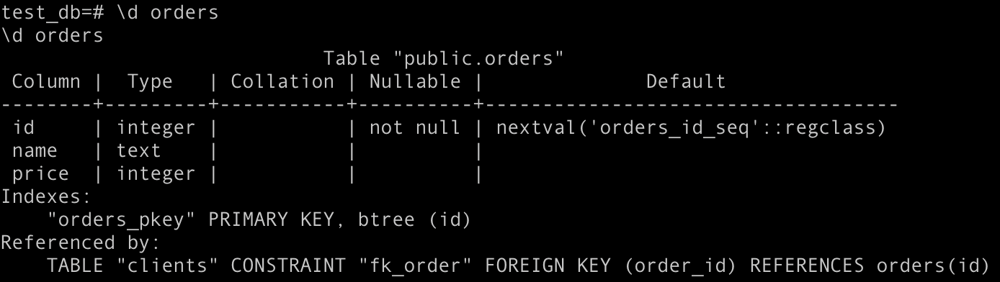

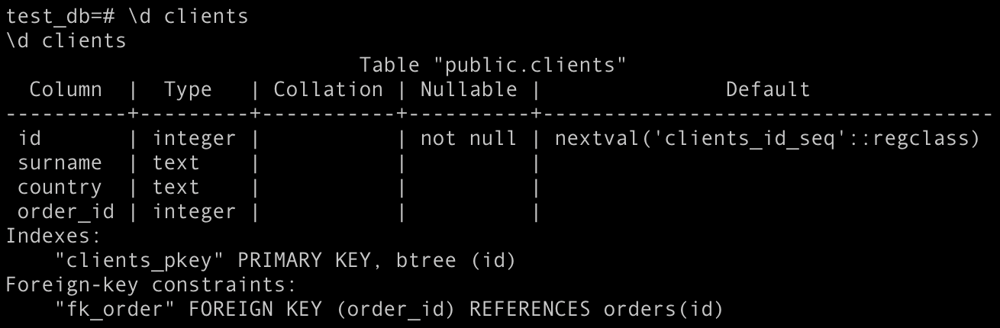

SQL-запрос для выдачи списка пользователей с правами над таблицами test_db:
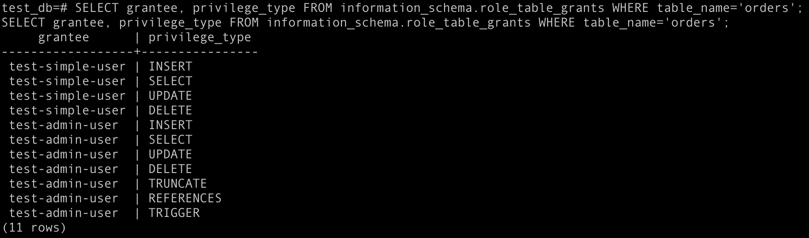

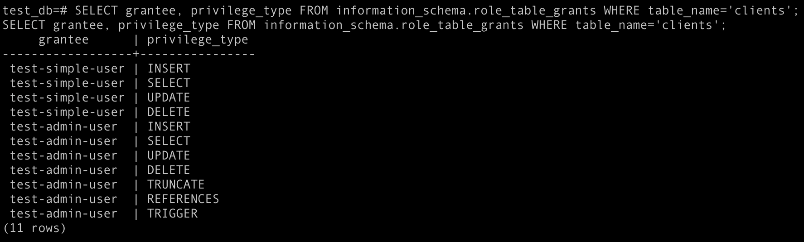


## Задача 3

INSERT INTO orders(name, price) VALUES('chocolate', 10), ('printer', 3000), ('book', 500), ('monitor', 7000), ('guitar', 4000);

INSERT INTO clients(surname, country) VALUES('Иванов Иван Иванович', 'USA'), ('Петров Петр Петрович', 'Canada'), ('Иоганн Себастьян Бах', 'Japan'), ('Ронни Джеймс Дио', 'Russia'), ('Ritchie Blackmore', 'Russia');

select count(*) from orders;
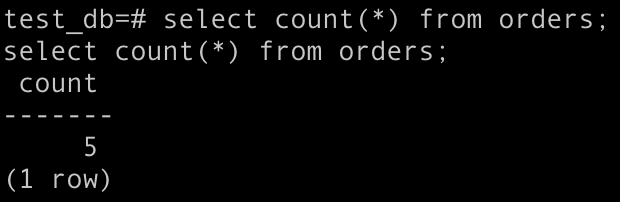

select count(*) from clients;
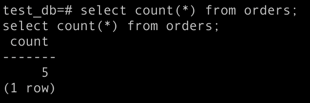


## Задача 4

* SQL-запросы для выполнения данных операций:
UPDATE clients SET order_id = sub.id FROM (select id from orders where orders.name = 'book') as sub WHERE clients.surname = 'Иванов Иван Иванович';

UPDATE clients SET order_id = sub.id FROM (select id from orders where orders.name = 'monitor') as sub WHERE clients.surname = 'Петров Петр Петрович';

UPDATE clients SET order_id = sub.id FROM (select id from orders where orders.name = 'guitar') as sub WHERE clients.surname = 'Иоганн Себастьян Бах';


* SQL-запрос для выдачи всех пользователей, которые совершили заказ:

select * from clients where order_id is not null;
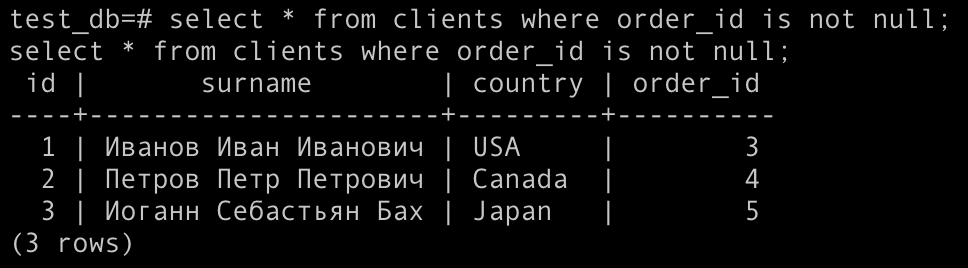

select clients.surname, orders.name from clients, orders where clients.order_id = orders.id;
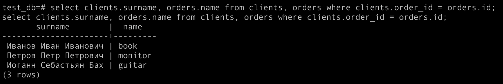

## Задача 5
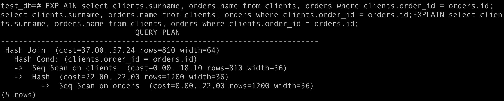
Для этого запроса с подзапросом Postgres использует стратегию Hash Join: Postgres последовательно сканирует внутренний select и строит хеш-таблицу, в которой хеш-ключ состоит из всех ключей соединения, использующих оператор =. Затем он последовательно просматривает внешний select и исследует хэш для каждой найденной строки, чтобы найти совпадающие id.
Seq Scan (последовательном сканирование) означает, что Postgres последовательно проходит по таблице, и каждая запись последовательно просматривается на соответствие условию.
Для Orders и Clients использует Seq Scan, потому что таблицы маленькие, даже если Postgres автоматически создает индексы для PK, использовать их здесь не рационально, потому что при использовании индекса нам нужно сначала получить доступ к блокам, соответствующим индексу, а затем к фактическим блокам таблицы. Но при последовательном сканировании нам просто нужно получить доступ к блокам таблицы.

Тоже самое верно и для второго запроса:
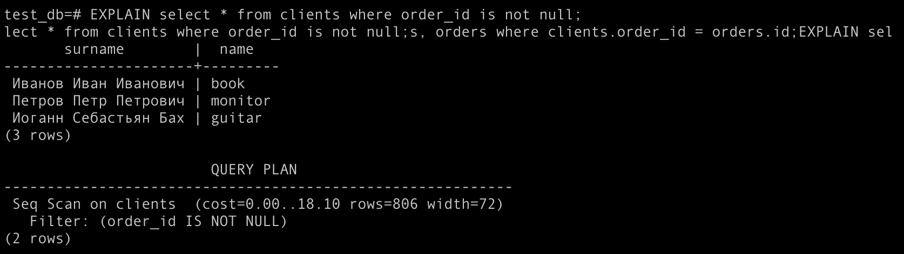

## Задача 6

* pg_dump -h database -U test-admin-user -Fc test_db > /tmp/backup/db.dump
* docker stop hw5
* docker run --name pgdocker -e POSTGRES_PASSWORD=1234 -e POSTGRES_USER=test-admin-user -e POSTGRES_DB=test_db1 -d -p 5432:5432 -v hw5_database-backup:/tmp/backup/ postgres
* pg_restore -U test-admin-user -d test_db1 /tmp/backup/db.dump
* psql -U test-admin-user -d test_db1
* select * from clients;
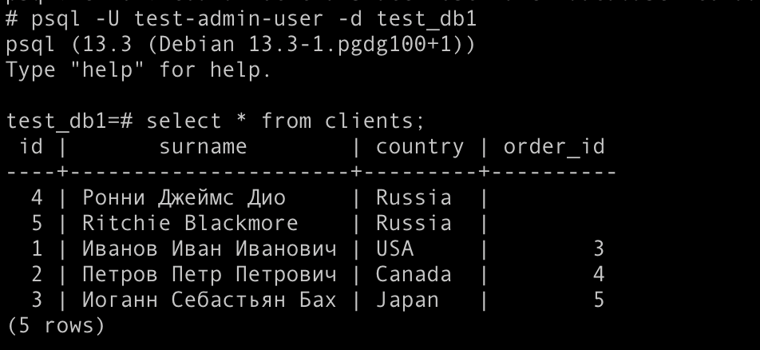