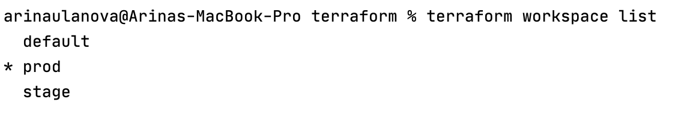
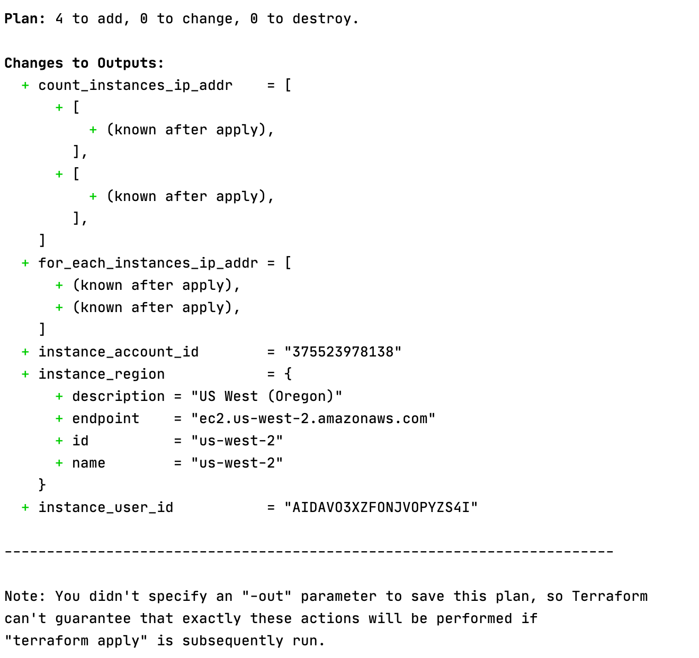
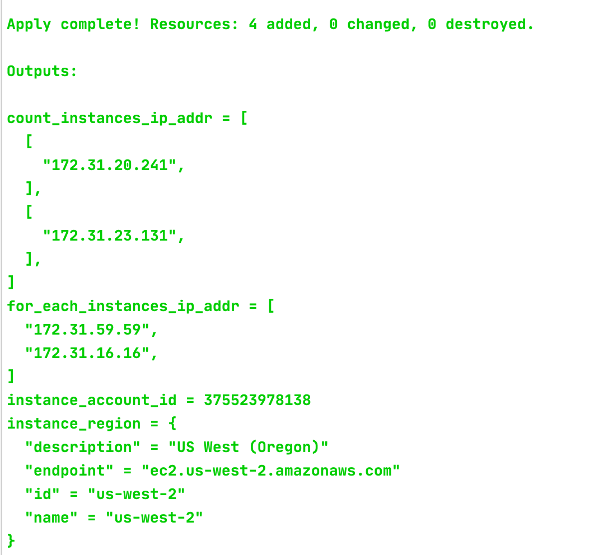

# Домашнее задание к занятию "7.3. Основы и принцип работы Терраформ"

https://github.com/netology-code/virt-homeworks/tree/master/07-terraform-03-basic

## Задача 1. Создадим бэкэнд в S3

## Задача 2. Инициализируем проект и создаем воркспейсы

terraform plan:

После terraform apply (после задачи 1):

