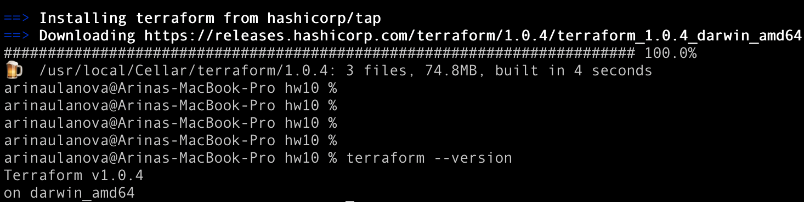
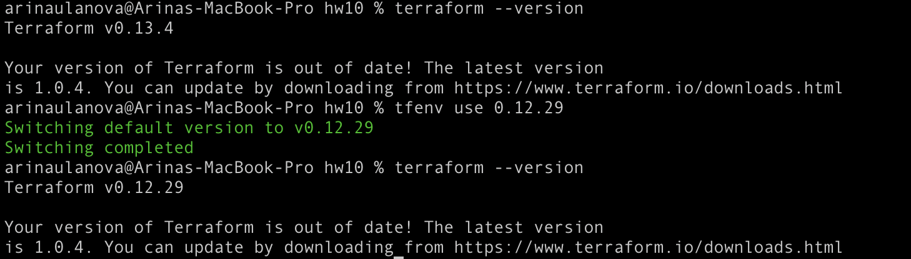

# Домашнее задание к занятию "7.1. Инфраструктура как код"

https://github.com/netology-code/virt-homeworks/tree/master/07-terraform-01-intro

* остатки Сloud Formation:
нет центрального сервера, декларативный (как Terraform)
* некоторые образы сделаны при помощи Packer:
декларативный (одинаковые образы машин)
* год назад начали активно использовать Terraform:
декларативный, нет центрального сервера
* разработчики привыкли использовать Docker;
* уже есть большая база Kubernetes конфигураций;
* для автоматизации процессов используется Teamcity;
* также есть совсем немного Ansible скриптов;
* и ряд bash скриптов для упрощения рутинных задач.

## Задача 1. Выбор инструментов

* Какой тип инфраструктуры будем использовать для этого проекта: изменяемый или не изменяемый?

Чтобы не было расхождений в конфигурациях разных серверов, лучше сделать инфраструктуру неизменяемой.
* Будет ли центральный сервер для управления инфраструктурой?

Если выбираем использовать дальше Сloud Formation или Terraform, то тогда не будет центрального сервера, потому что по умолчанию у них его нет.
* Будут ли агенты на серверах?

Если выбираем использовать Сloud Formation или Terraform, то они не требуют агентов на серверах, поэтому их не будет.
* Будут ли использованы средства для управления конфигурацией или инициализации ресурсов?

Так как уже есть опыт использования Packer(шаблонизация), Docker и Kubernetes (оркестрация контейнеров), то можно реализовать схему инициализации ресурсов, шаблонизации и оркестрации на их базе с Terraform (инициализация). В качестве CI оставить TeamCity.
## Задача 2. Установка терраформ

## Задача 3. Поддержка легаси кода

