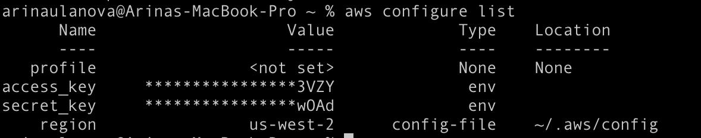
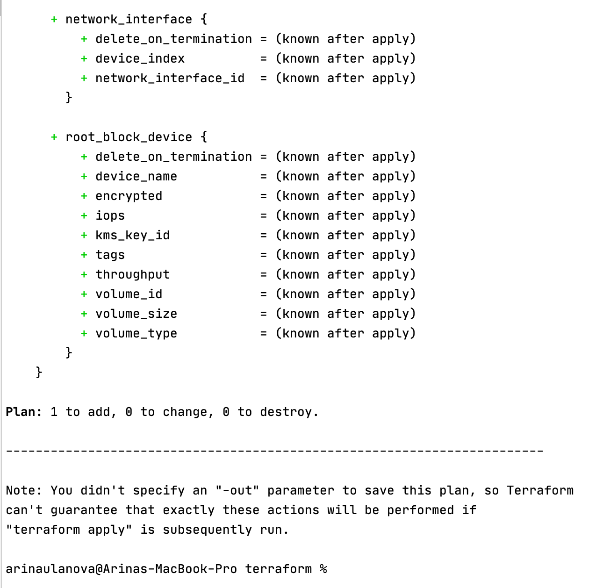

# Домашнее задание к занятию "7.1. Инфраструктура как код"

https://github.com/netology-code/virt-homeworks/tree/master/07-terraform-02-syntax

## Задача 1. Регистрация в aws и знакомство с основами

## Задача 2. Создание ec2 через терраформ

Образ ami можно сделать с помощью Packer: https://learn.hashicorp.com/tutorials/packer/aws-get-started-build-image?in=packer/aws-get-started

